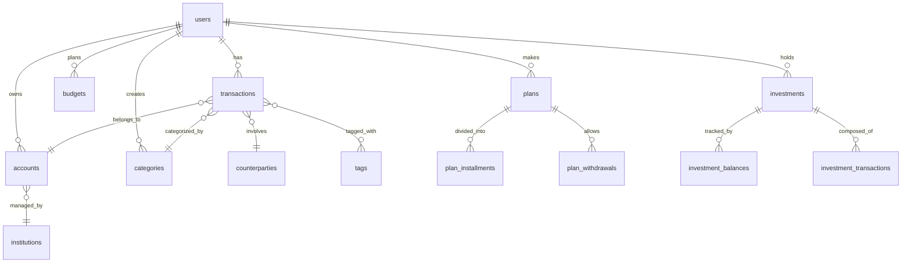
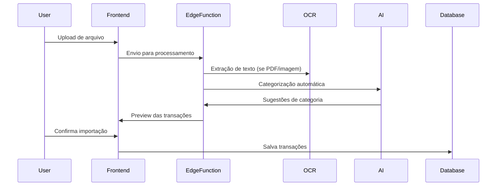
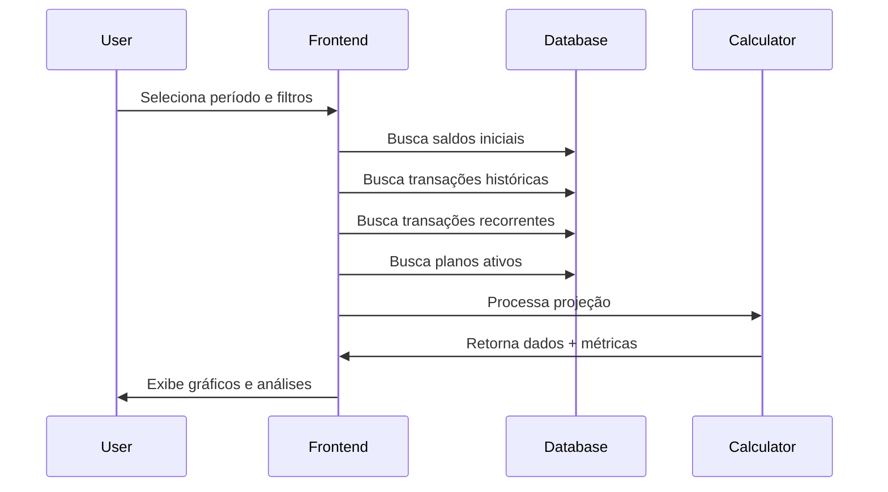

# Sistema de Gestão Financeira Pessoal

## 🎯 Visão Geral

Este é um **sistema completo de gestão financeira pessoal** desenvolvido para pessoas que buscam controle total sobre suas finanças. A aplicação oferece uma abordagem holística para planejamento financeiro, combinando análise histórica, controle presente e projeção futura em uma interface intuitiva e moderna.

### 🌟 Diferenciais Competitivos

- **Foco em Projeções**: Não apenas registra o passado, mas simula cenários futuros
- **Análise Preditiva**: Sistema de análise de risco e volatilidade financeira
- **Importação Inteligente**: OCR + IA para categorização automática de transações
- **Integração Completa**: Todos os módulos trabalham em sinergia
- **Tempo Real**: Atualizações instantâneas entre todos os componentes

---

## 🏗️ Arquitetura do Sistema

### **Frontend**
- **React 18** + **TypeScript** para type safety
- **Vite** como bundler para desenvolvimento rápido
- **TanStack Query** para cache inteligente e sincronização
- **React Router** para navegação SPA
- **Zod** para validação de dados

### **UI/UX**
- **shadcn/ui** como base de componentes
- **Tailwind CSS** para estilização utilitária
- **Tema customizado "mint"** com tokens semânticos
- **Responsive design** com foco mobile-first
- **Dark/Light mode** suportado

### **Backend**
- **Supabase** como BaaS (Backend as a Service)
- **PostgreSQL** para persistência de dados
- **Row Level Security (RLS)** para segurança
- **Edge Functions** para processamento serverless
- **Realtime subscriptions** para atualizações ao vivo

### **Integração com IA**
- **Edge Functions** customizadas para categorização automática
- **OCR** para extração de dados de comprovantes
- **N8N** para automação de workflows
- **Análise preditiva** de padrões financeiros

---

## 🎛️ Módulos e Funcionalidades

### 📊 **1. Projeções de Fluxo de Caixa** (Módulo Principal)
*Página: `/projecoes`*

**Objetivo**: Simular cenários financeiros futuros com base em dados históricos e planejamentos.

**Funcionalidades:**
- **Períodos configuráveis**: 30, 90, 180 dias, 1 ano
- **Simulação de cenários**: Inclusão/exclusão de transações recorrentes, planos e passivos
- **Métricas avançadas**:
  - Liquidez atual
  - Pior dia projetado
  - Dias com saldo negativo
  - Volatilidade financeira
  - Saldo final projetado
- **Análise de risco**: Classificação automática (baixo, médio, alto)
- **Gráficos interativos**: Visualização do fluxo de caixa ao longo do tempo
- **Eventos-chave**: Identificação automática de salários, gastos grandes, etc.

**Algoritmos:**
- Cálculo de volatilidade baseado em desvio padrão
- Análise de tendência usando regressão linear
- Score de risco multifatorial

### 💰 **2. Planejamento e Orçamento**
*Página: `/planejamento`*

**Objetivo**: Controle orçamentário mensal com categorização hierárquica.

**Funcionalidades:**
- **Orçamento por categorias**: Sistema hierárquico (categoria pai/subcategorias)
- **Tipos de orçamento**: Fixo vs Variável
- **Comparação Planejado vs Realizado**: Análise de variações
- **Seletor de mês**: Navegação temporal para análise histórica
- **Alertas de limite**: Notificações quando próximo ao limite
- **Relatórios visuais**: Gráficos de distribuição e tendências

### 📝 **3. Lançamentos (Transações)**
*Página: `/lancamentos`*

**Objetivo**: Gestão completa de receitas, despesas e transferências.

**Funcionalidades:**
- **CRUD completo**: Criar, editar, excluir transações
- **Tipos de transação**: Receita, Despesa, Transferência
- **Categorização**: Sistema hierárquico com auto-complete
- **Tags**: Sistema flexível de etiquetagem
- **Parcelamento**: Criação automática de parcelas
- **Transações recorrentes**: Padrões repetitivos automatizados
- **Importação inteligente**: 
  - Upload de extratos (PDF, CSV, OFX)
  - OCR para leitura de comprovantes
  - IA para categorização automática
  - Preview antes da importação
- **Filtros avançados**: Por período, categoria, conta, tag
- **Busca full-text**: Pesquisa em descrições e notas
- **Reconciliação**: Conferência com saldos bancários

**Recursos Avançados:**
- **Bulk operations**: Ações em massa
- **Transferências inteligentes**: Criação automática de contrapartida
- **Contrapartidas**: Gestão de fornecedores/clientes
- **Anexos**: Upload de comprovantes
- **Auditoria**: Log de alterações

### 📈 **4. Investimentos**
*Página: `/investimentos`*

**Objetivo**: Gestão de carteira de investimentos e cálculo de independência financeira.

**Funcionalidades:**
- **Tipos de investimento**: Renda Fixa, Renda Variável, Fundos, Crypto, etc.
- **Acompanhamento de saldos**: Histórico mensal de valores
- **Rentabilidade**: Cálculo de performance por investimento
- **Carteira consolidada**: Visão global da distribuição
- **Gráficos de composição**: Pizza, barras, evolução temporal
- **Metas de independência**: Cálculo baseado em custos mensais
- **Integração com indicadores**: SELIC, CDI, IPCA (via Edge Functions)
- **Simuladores**: Projeção de crescimento da carteira

### 🎯 **5. Planos e Metas**
*Página: `/planos`*

**Objetivo**: Gestão de objetivos financeiros de longo prazo.

**Funcionalidades:**
- **Tipos de plano**: Poupança, Pagamento de dívidas, Metas específicas
- **Sistema de parcelas**: Divisão automática em pagamentos
- **Timeline visual**: Cronograma de execução
- **Liquidação flexível**: Quitação antecipada ou parcial
- **Saques programados**: Para planos de poupança
- **Impacto nas projeções**: Visualização do efeito no fluxo futuro
- **Upload de imagens**: Motivação visual para metas
- **Notificações**: Lembretes de vencimentos

### 🏦 **6. Contas e Instituições**
*Página: `/contas`*

**Objetivo**: Gestão centralizada de contas bancárias e cartões.

**Funcionalidades:**
- **Contas bancárias**: Corrente, poupança, investimento
- **Cartões de crédito**: Gestão de limites e faturas
- **Instituições financeiras**: Cadastro de bancos/corretoras
- **Saldos iniciais**: Definição de ponto de partida
- **Reconciliação automática**: Comparação com extratos
- **Histórico de saldos**: Evolução ao longo do tempo
- **Tipos de conta**: On-budget vs Off-budget

### ⚙️ **7. Configurações e Ferramentas**
*Páginas: `/configuracoes`, `/ferramentas`*

**Funcionalidades:**
- **Perfil do usuário**: Dados pessoais e preferências
- **Contas padrão**: Definição de contas favoritas
- **Simulador de juros compostos**: Ferramenta educativa
- **Configurações de reconciliação**: Métodos e frequências
- **Reset do sistema**: Limpeza de dados para recomeço
- **Backup/Restore**: Exportação de dados

---

## 🗄️ Modelo de Dados

### **Entidades Principais**



### **Tabelas Críticas**

1. **`transactions`**: Núcleo do sistema - todas as movimentações financeiras
2. **`accounts`**: Contas bancárias e cartões com tipos e subtipos
3. **`categories`**: Hierarquia de categorias (pai/filho) para organização
4. **`recurring_transactions`**: Templates para transações recorrentes
5. **`plans`**: Metas e planos financeiros com cronogramas
6. **`investments`**: Carteira de investimentos com tracking de performance
7. **`budgets`**: Orçamentos mensais por categoria

### **Recursos de Segurança**

- **Row Level Security (RLS)**: Isolamento total entre usuários
- **Políticas granulares**: Controle fino de acesso por operação
- **Validação no cliente e servidor**: Dupla camada de proteção
- **Triggers de auditoria**: Log automático de alterações críticas

---

## 🔄 Fluxos de Trabalho Principais

### **1. Fluxo de Importação de Transações**



### **2. Fluxo de Projeção de Fluxo de Caixa**



---

## 🚀 Configuração e Desenvolvimento

### **Pré-requisitos**
- Node.js 18+ 
- npm ou yarn
- Conta Supabase (para backend)

### **Instalação**

```bash
# Clone o repositório
git clone <repository-url>
cd financial-management-system

# Instale dependências
npm install

# Configure variáveis de ambiente
cp .env.example .env
# Configure SUPABASE_URL e SUPABASE_ANON_KEY

# Execute em desenvolvimento
npm run dev
```

### **Scripts Disponíveis**

```bash
npm run dev          # Servidor de desenvolvimento
npm run build        # Build para produção
npm run preview      # Preview do build
npm run lint         # Linting do código
npm run type-check   # Verificação de tipos TypeScript
```

### **Estrutura de Pastas**

```
src/
├── components/          # Componentes React organizados por domínio
│   ├── ui/             # Componentes base (shadcn/ui)
│   ├── layout/         # Layout e navegação
│   ├── transactions/   # Gestão de transações
│   ├── investments/    # Gestão de investimentos
│   ├── planning/       # Planejamento e orçamento
│   └── ...
├── hooks/              # Custom hooks para lógica de negócio
├── pages/              # Páginas da aplicação (rotas)
├── lib/                # Utilitários e configurações
├── contexts/           # Context providers (Auth, etc.)
└── integrations/       # Integrações externas (Supabase)
```

---

## 📱 Experiência do Usuário

### **Design System**
- **Tema "Mint"**: Paleta verde/azul para transmitir confiança financeira
- **Tokens semânticos**: Cores, tipografia e espaçamentos consistentes
- **Componentes reutilizáveis**: Base sólida para desenvolvimento
- **Acessibilidade**: Contraste adequado e navegação por teclado

### **Responsividade**
- **Mobile-first**: Otimizado para uso em smartphones
- **Breakpoints adaptativos**: Ajuste automático para diferentes telas
- **Navegação contextual**: Sidebars colapsáveis e menus adaptativos
- **Touch-friendly**: Botões e áreas de toque adequadas

### **Performance**
- **Lazy loading**: Carregamento sob demanda de componentes
- **Cache inteligente**: TanStack Query para otimização de requisições
- **Otimização de bundle**: Code splitting automático
- **Debouncing**: Pesquisas e filtros otimizados

---

## 🔮 Roadmap e Futuras Funcionalidades

### **Fase 1 - Melhorias Imediatas**
- [ ] Dashboard executivo na página "Panorama"
- [ ] Notificações push para lembretes
- [ ] Exportação de relatórios (PDF/Excel)
- [ ] Backup automático de dados

### **Fase 2 - Expansão de Recursos**
- [ ] Múltiplas moedas
- [ ] Integração com Open Banking
- [ ] Machine Learning para detecção de anomalias
- [ ] App mobile nativo

### **Fase 3 - Funcionalidades Avançadas**
- [ ] Compartilhamento familiar de orçamentos
- [ ] Consultoria financeira automatizada
- [ ] Integração com marketplaces de investimentos
- [ ] API pública para integrações

---

## 🤝 Contribuição

Este projeto é desenvolvido com foco na experiência do usuário e qualidade de código. Contribuições são bem-vindas através de:

1. **Issues**: Reporte bugs ou sugira melhorias
2. **Pull Requests**: Implemente funcionalidades ou correções
3. **Documentação**: Melhore este README ou documentação técnica
4. **Testes**: Adicione cobertura de testes para maior confiabilidade

### **Padrões de Código**
- **TypeScript strict mode**: Type safety em primeiro lugar
- **ESLint + Prettier**: Formatação consistente
- **Conventional Commits**: Mensagens padronizadas de commit
- **Component isolation**: Componentes pequenos e focados

---

## 📄 Licença

Este projeto está licenciado sob a MIT License - veja o arquivo [LICENSE](LICENSE) para detalhes.

---

## 🛠️ Suporte Técnico

Para questões técnicas ou suporte:
- **Issues**: Use o sistema de issues do GitHub
- **Documentação**: Consulte a wiki do projeto
- **Lovable Platform**: Utilize o chat do Lovable para desenvolvimento assistido

---

*Desenvolvido com ❤️ para democratizar o controle financeiro pessoal*
